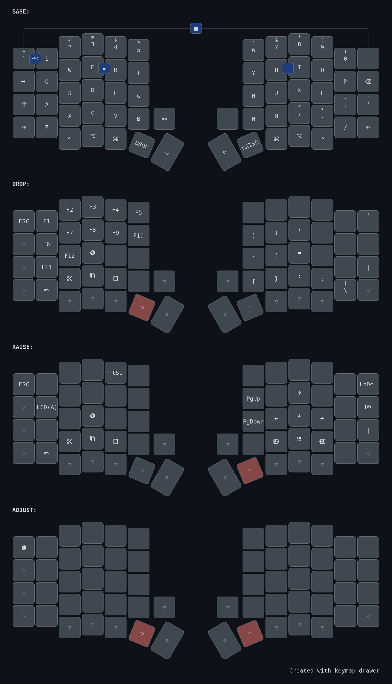

# My keymap for Sofle Keyboard

<div align="center">
  <a href="keymap.yaml">
    
  </a>
</div>


Utils:
- [Logo Editor](https://joric.github.io/qle/)
- [Keymap Editor](https://keymap-drawer.streamlit.app/)
- [MDI Icons](https://pictogrammers.com/library/mdi/)


Compile Command:
```
qmk compile -e CONVERT_TO=promicro_rp2040   
```

